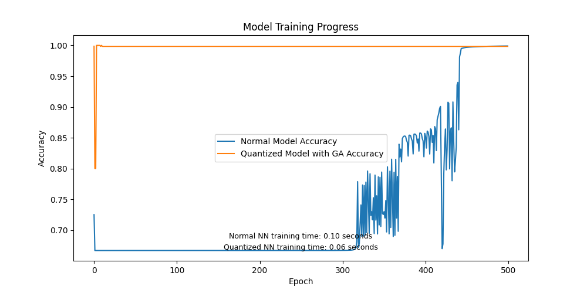

# Neural Network Optimization Comparison

## Getting Started 🚀

1. Clone the repository: `git clone [repository_url]`
2. Install dependencies: `pip install -r requirements.txt`
3. Run script for XOR Problem: `python xor_testing.py`
4. Run script for MNIST Dataset: `python mnist_testing.py`

## Project Description

This project aims to compare the performance of various neural network models and optimization algorithms on different datasets. The models include standard neural networks, quantized neural networks, and models implemented in PyTorch. The optimization algorithms include Genetic Algorithm (GA) and Particle Swarm Optimization (PSO).

## Models and Optimizers

### Custom Models
- **Neural Network**: A basic feedforward neural network implemented from scratch.
- **Quantized Neural Network**: A neural network with quantized weights for improved efficiency.

### PyTorch Models
- **XOR_Model**: A model for the XOR problem using Adam optimizer.
- **XOR_GA_Model**: A model for the XOR problem using Genetic Algorithm.
- **XOR_PSO_Model**: A model for the XOR problem using Particle Swarm Optimization.
- **Mnist_Model**: A model for the MNIST dataset using Adam optimizer.
- **Mnist_GA_Model**: A model for the MNIST dataset using Genetic Algorithm.
- **Mnist_PSO_Model**: A model for the MNIST dataset using Particle Swarm Optimization.

### Custom Optimizers
- **Genetic Algorithm**
  - **Functions**:
    - **`__init__`**: Initializes the optimizer with a given model, population size, mutation rate, and weight range.
    - **`_get_model_parameters`**: Retrieves the model parameters as a list of numpy arrays.
    - **`_set_model_parameters`**: Sets the model parameters from a given list of numpy arrays.
    - **`generate_population`**: Generates an initial population of solutions with random weights.
    - **`fitness_function`**: Calculates the fitness of a model based on the inverse of the loss function.
    - **`layer_crossover`**: Performs uniform crossover between two parent solutions at the layer level.
    - **`neuron_crossover`**: Performs uniform crossover between two parent solutions at the neuron level.
    - **`mutate`**: Mutates a given solution by randomly altering its weights.
    - **`step`**: Executes one iteration of the genetic algorithm, involving evaluation of the population, selection of the best individuals, and creation of a new population through crossover and mutation.
  - **Usage in Models**:
    - **`Mnist_GA_Model`**: Trains a PyTorch model for the MNIST dataset.
    - **`XOR_GA_Model`**: Trains a PyTorch model for the XOR problem.
    - **`Quantized_NN`**: Trains a custom quantized neural network.

- **Particle Swarm Optimization**
  - **Functions**:
    - **`__init__`**: Initializes the optimizer with a given model, weight range, number of particles, and clipping option.
    - **`_get_model_parameters`**: Retrieves the model parameters as a list of numpy arrays.
    - **`_set_model_parameters`**: Sets the model parameters from a given list of numpy arrays.
    - **`generate_particles`**: Generates a swarm of particles with random positions and velocities.
    - **`objective_function`**: Calculates the objective value (loss) of a model.
    - **`clip_move`**: Moves a particle with clipping.
    - **`move`**: Moves a particle without clipping.
    - **`step`**: Executes one iteration of the particle swarm optimization algorithm, involving updating the velocity and position of each particle based on cognitive and social components.
  - **Usage in Models**:
    - **`Mnist_PSO_Model`**: Trains a PyTorch model for the MNIST dataset.
    - **`XOR_PSO_Model`**: Trains a PyTorch model for the XOR problem.
    - **`Quantized_NN`**: Trains a custom quantized neural network.

## File Structure

### 📄 `main.py`
This file is the entry point for the XOR problem comparisons. It trains and evaluates multiple models using different optimization algorithms and plots the results.

### 📄 `mnist_testing.py`
This file is used to compare the performance of different models and optimizers on the MNIST dataset. It includes data loading, training, and evaluation.

### 📄 `neural_network.py`
Contains the implementation of a basic feedforward neural network from scratch.

### 📄 `quantized_nn.py`
Contains the implementation of a quantized neural network with various activation functions and layers.

### 📄 `custom_pytorch_models.py`
Contains PyTorch implementations of models for the XOR problem and the MNIST dataset, including models optimized with Genetic Algorithm and Particle Swarm Optimization.

### 📄 `custom_pytorch_optimizers.py`
Contains custom PyTorch optimizers including Genetic Algorithm and Particle Swarm Optimization.

### 📄 `custom_optimizers.py`
Contains custom implementations of Genetic Algorithm and Particle Swarm Optimization tailored for quantized neural networks.

## Results 📊

Results are visualized using Matplotlib to compare the training loss and accuracy of each model over epochs. The performance of different optimization algorithms is compared in terms of training time, final loss, and accuracy.
### XOR Problem


### MNIST Dataset
- **Adam**:
  
- **Genetic Algorithm**:
  

## Installation

### Requirements

- Python 3.8+
- numpy
- matplotlib
- torch
- torchvision
- numba

To install the required packages, run:

```sh
pip install -r requirements.txt
